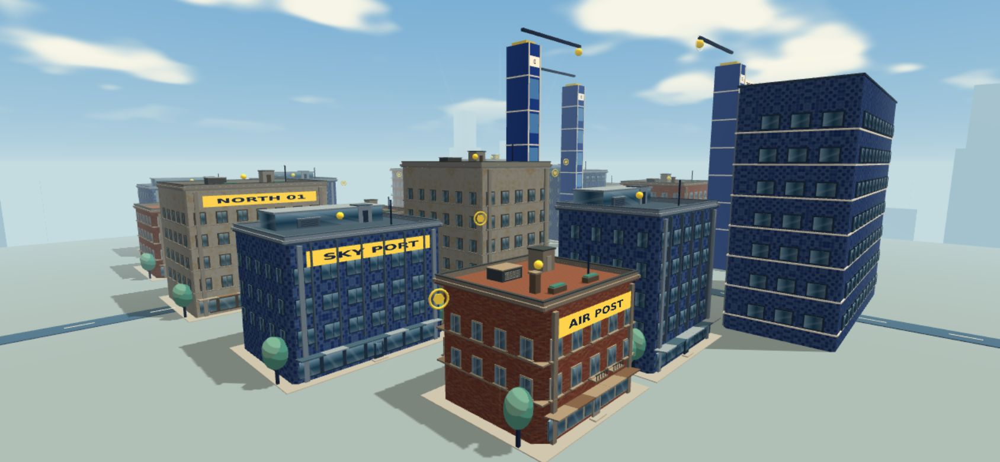
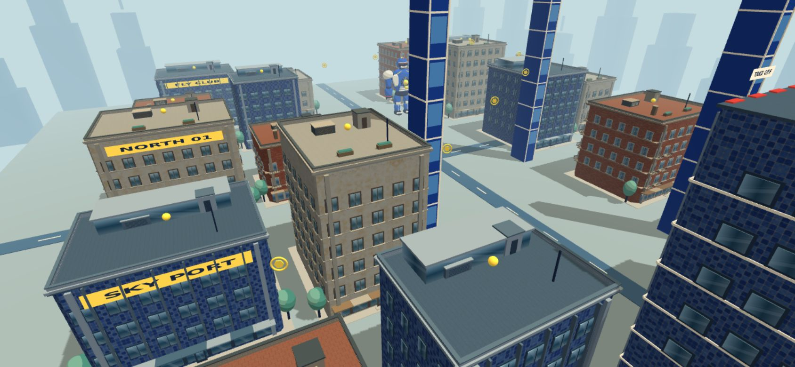
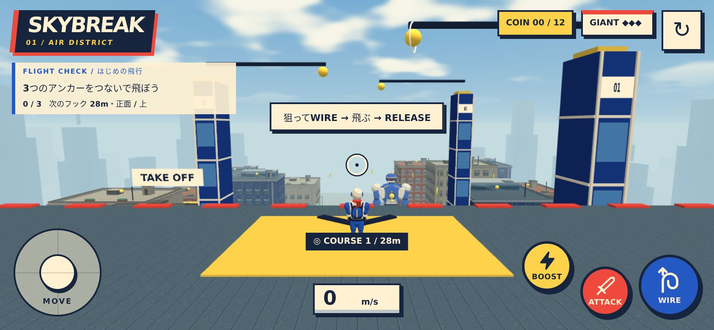

# 外壁に合わせた窓と屋上

生成した外壁の3種類に合わせて、窓・縁取り・屋上・設備の素材を統一しました。

| 外壁 | 窓 | 屋上と設備 |
| --- | --- | --- |
| テラコッタのレンガ | アイボリーの枠、中央の桟、石の窓台、細い金属手すり | テラコッタの目地、煙突、暖色のプランター |
| コバルトのタイル | 細い濃色の金属枠、幅広いガラス、金属の縦フィン | 青灰色の金属の継ぎ目、金属の縁、換気設備 |
| クリームの塗り壁 | 暖色の枠、窓台、落ち着いた青緑のガラス | 石調の表面と目地、石色の縁、植栽 |

## 表現と描画

- ガラスは共有の128×128テクスチャに空色のグラデーションと斜めのハイライトを描き、控えめな光沢を設定しています。動的な鏡面反射ではなく、コミック表現に合わせた空の映り込みです。透明描画は使いません。
- 屋上は共有の256×256テクスチャで細かな粒と目地を表現します。UVは実寸で、4mごとに反復します。毎フレームのテクスチャ更新や外部素材のダウンロードはありません。
- 屋上の縁を4辺で作り、天面の模様を見せています。換気装置のルーバー、屋上出入口、住宅の煙突・プランターを追加しました。
- 窓枠・手すり・店先のひさし・ドアも各建物の素材に合わせています。開始地点には青灰色の屋上を適用し、黄色い発進マークを維持しています。
- 屋上は素材別の3メッシュ、窓と設備は素材別の静的メッシュへまとめます。追加の実行時依存関係はありません。
- 衝突範囲、開始位置、ワイヤー接続点、飛行・収集・戦闘ルールは変更していません。装飾物は従来同様に描画専用です。

## 確認

- `npm run build`、`npm run verify:city`、`npm run verify:flight`、`npm run verify:gameplay`：成功。
- 開発版で全仕上げ素材と3種類の屋上バッチを確認。未読み込み素材、非有限の頂点／法線、コンソール・シェーダーエラーはありません。
- 本番版のPC・横画面スマホでワイヤー接続・ブースト・解除・リトライを確認。
- 描画回数は開始・飛行の確認場面で134回。外壁のみの118回から増えているため、スマホ実機でのFPS・発熱・長時間プレイは引き続き確認が必要です。
