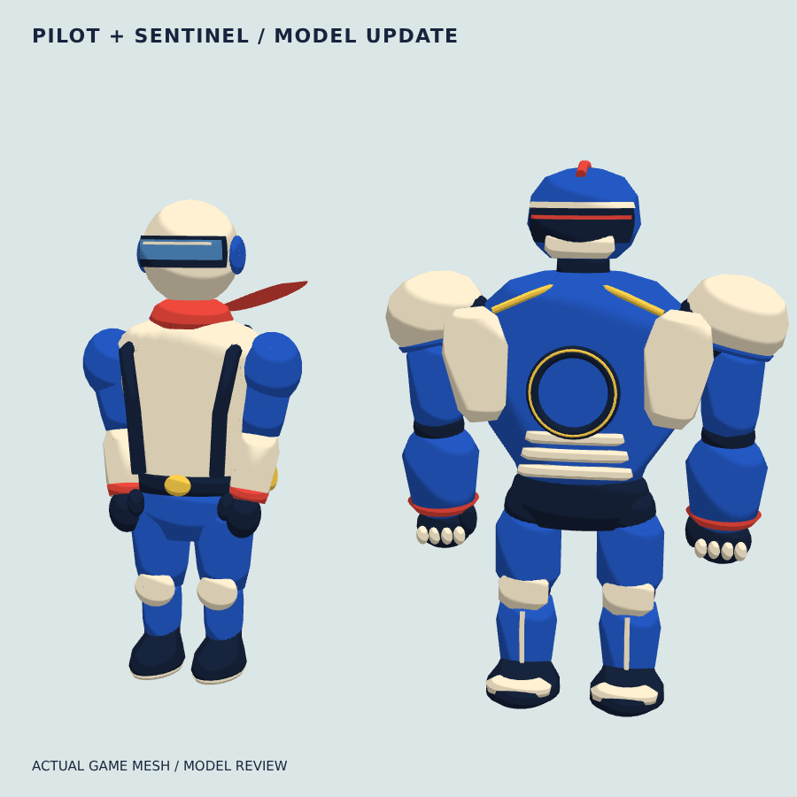
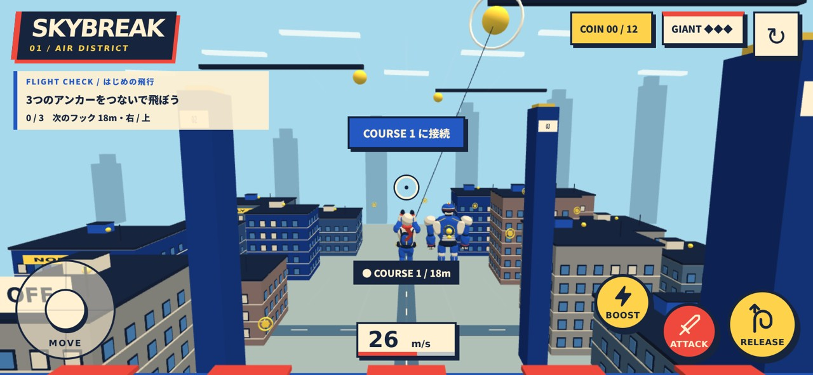

# 主人公・巨人の3Dモデル更新 / 2026-10-08

胴体・腕・脚・装甲が直方体の積み重ねに見えていたため、主人公と巨人のメッシュを作り直しました。コミック調の色は継続し、輪郭と関節の動きで品質を上げています。

実際にゲームへ組み込んだメッシュの近接表示。造形を比較できるよう表示サイズを揃えています。ゲーム内では巨人が大きく、胸に黄色い弱点が表示されます。

## 変更

- 主人公：肩から腰へ絞ったジャケット、骨盤・太もも・ふくらはぎの連続した曲面、厚みのあるブーツ。ヘルメットに沿うバイザーと反射ライン、ハーネス、背面パックとワイヤーリール。
- 関節：肩・肘・股関節・膝を別々に動かす。接続中は肘を曲げて腕を上げ、左右の脚に違うポーズを付ける。
- スカーフ：18区間の連続した布メッシュを毎フレーム変形し、根元から先端へ波を伝える。
- 巨人：胸郭から腰へ絞った胴体、ドーム形の肩装甲、曲面の胸当て・兜・顎ガード、腹部の重なる装甲、膝当て・すね当て・拳。頭と腕に小さな待機動作、被弾時の頭部反応を付ける。
- 陰影：3段階の境界を少しなだらかにして、曲面が読めるように調整。

`src/character-models.ts` に、断面をつないで形を作るロフト、曲面バイザー、関節、モデルをまとめました。自作の形状で、外部モデルや追加依存関係はありません。物理・収集・攻撃の条件、弱点とワイヤーの基準座標は既存のものを使用しています。

## 実際のプレイ画面

## 確認

- 型チェック、本番ビルド、既存の飛行・進行テストを通過。
- 主人公の正面・背面・飛行姿勢、巨人の近接表示で造形確認。頂点・法線にNaNやInfinityなし、シェーダーエラーなし。
- PC 1440×900、横画面スマホ844×390（DPR 2）で接続・加速・解除・リトライを確認。移動とカメラの2本指操作、キャンセル、縦画面への変更も確認。
- 本番ビルドでもモデル表示・シェーダー・タッチ接続・リトライを確認。コンソールエラーなし。
- 主人公8,460頂点、巨人12,783頂点。全シーン約130,800頂点。確認した開始・飛行・入力場面で127〜132描画/フレーム、9テクスチャ。
- 同じ関節に固定されたパーツは材質ごとにまとめ描画。関節や布の可動部分は分離。

描画回数はブラウザのエミュレーションで測定した値です。スマホ実機のFPS・発熱・長時間プレイは未確認です。
