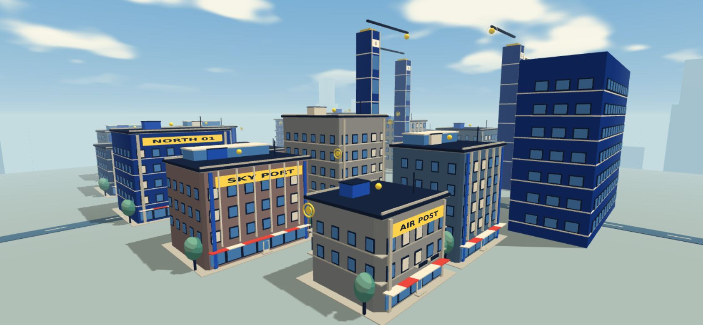
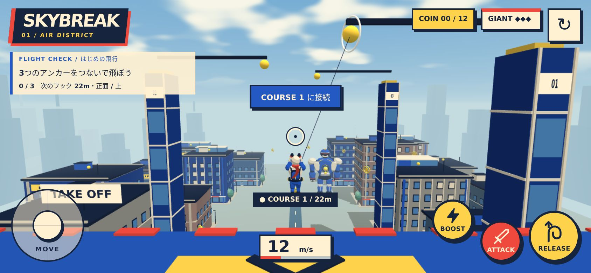

# 街と空の更新 / 2026-10-09

コミック調の配色を保ち、建物の外壁・街路・空・遠景を更新しました。画像は実装をブラウザで撮影したものです。

## 変更

- 建物本体を、小さく角を落とした閉じたメッシュに変更。住宅はバルコニー、現代的なビルは縦のフィンと屋上のガラス構造、商業ビルは階の帯で外壁のリズムを分けています。
- 地上階にガラスの店舗、入口、階段、赤とクリームの庇。歩道、街路樹、街灯を追加。離陸ビルとコース支柱にも外壁を追加しました。
- 遠景を全周に配置し、2層のスカイライン、段状の塔と尖塔、低い丘で奥行きを付けました。
- 単色の空と箱形の雲を、空のグラデーション、暖かい太陽の光、緩やかに流れるノイズの雲に変更。遠くの建物・ディテール・キャラクターを同じ地平線色へ霞ませています。
- 太陽の向きと陰影をそろえ、建物と街路樹が地面に落とす影を追加しました。

飛行・衝突・アンカー・コインの座標は既存のものを維持。建物本体の角の面取りは当たり判定の範囲内です。小さな外壁・屋上装飾は従来同様、非衝突の描画用パーツで、屋上中央のアンカーを隠さない配置にしています。

## 描画と検証

- 建築と街路の静的パーツを材質ごとに結合。空は1回の不透明描画で、ボリューム雲のレイマーチや追加の全画面ポスト処理は使いません。
- 1024pxの静的シャドウマップを初回に描画し、以後は再利用。動く主人公・巨人の影はこのマップに含めません。
- 型チェックと本番ビルド、既存の飛行・進行テストを通過。追加した `npm run verify:city` では9種類の建物形状について、当たり判定の範囲内、外向きの単位法線、閉じた面、既存メッシュとの結合を確認します。
- 開発版の横画面スマホ844×390、DPR 2で接続・解除・リトライを確認。頂点と法線にNaN/Infinityなし、未準備の材質なし、JavaScriptとシェーダーのエラーなし。
- 開発版の開始・接続時で約185,100頂点、134〜135描画/フレーム、10テクスチャ。解像度は引き続きCSSピクセルの1.5倍までです。
- 本番版のPC 1440×900と横画面スマホ844×390で、接続・加速・解除・リトライと描画を確認。コンソールエラーなし。

ソフトウェアWebGLでのブラウザ確認です。スマホ実機のFPS・発熱・長時間プレイは未確認です。Babylon.jsの大きなバンドルについての既存のビルド警告も残ります。

## 参考にしたスキル

- [Procedural Buildings and Cities](https://github.com/linegel/threejs-complete-set-of-skill/blob/main/skills/threejs-procedural-buildings-and-cities/SKILL.md)：建物の計画、外壁の役割、静的な形状の結合、法線と形状の検証。
- [Sky, Atmosphere and Haze](https://github.com/linegel/threejs-complete-set-of-skill/blob/main/skills/threejs-sky-atmosphere-and-haze/SKILL.md)：局所的な空と霞、太陽と空の光の整合、目的に合う軽量な描画方式。

Three.js/WebGPU向けの設計指針をBabylon.js 7.42へ適応しました。エンジン移行、外部モデル、追加の実行時依存関係はありません。雲と空は物理的な大気シミュレーションではなく、コミック調に合わせた表現です。
