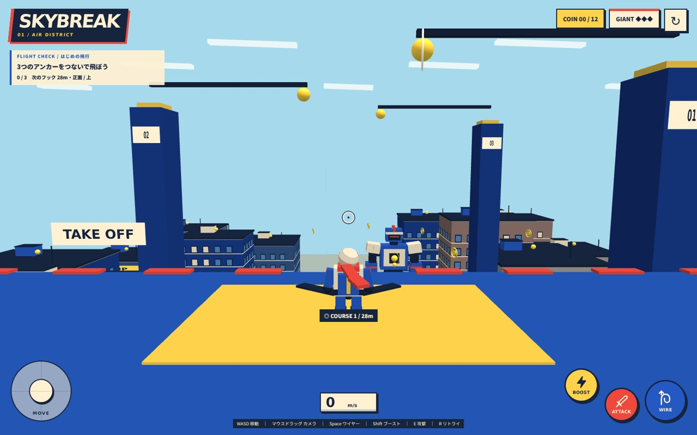
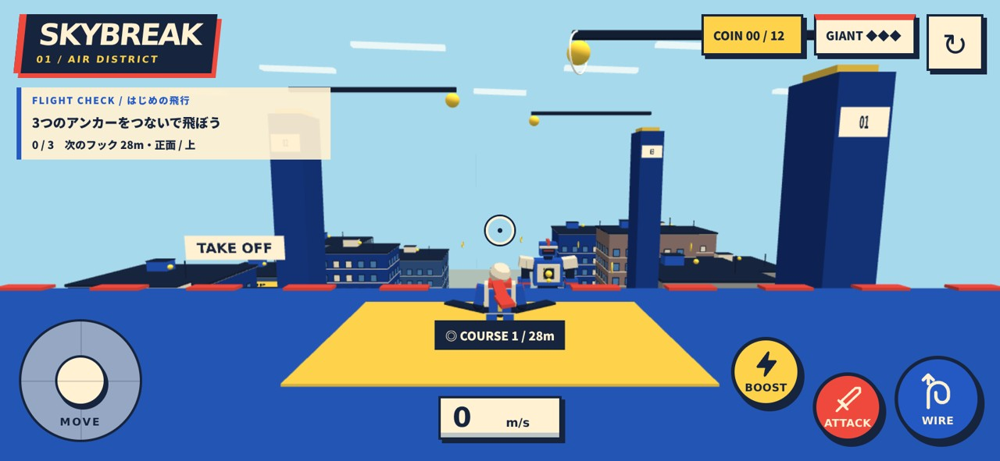
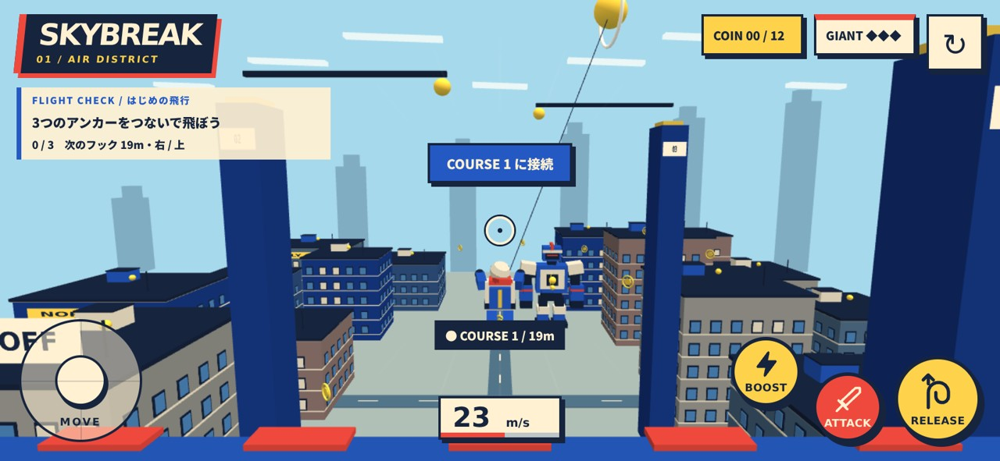

# Comic city / Stage 1

このページは2026-10-07の初回デザイン記録です。主人公・巨人の最新造形と画像は [2026-10-08の3Dモデル更新](character-models.md) を参照してください。

3案のうち「ポップなコミック」を採用。画面全体を、郵便・航路サインのある明るい飛行都市として揃える。画像案を参考にした、実際に動くBabylon.jsの試作です。

## 色と役割

| 色 | 値 | 主な役割 |
| --- | --- | --- |
| Ink | `#17243d` | 関節、窓枠、屋根縁、文字、ワイヤー |
| Cobalt | `#2459c4` | 衣装、装甲、航路支柱、接続ボタン |
| Paper | `#fff1d2` | 建築、肩の装甲、ヘルメット、情報背景 |
| Vermilion | `#ef493d` | 主人公のスカーフ、敵の目、攻撃ボタン |
| Signal | `#ffd24b` | コイン、フック、弱点、加速ボタン |
| Sky | `#a7d9ec` | 空。遠景は彩度とコントラストを抑える |

## 見た目と操作

- 主人公：ヘルメット、ゴーグル、ハーネス、バックパック、ブーツと赤いスカーフ。腕・脚は地上移動と空中接続でポーズを変える。
- 巨人：装甲と濃紺の関節を分け、肩・膝・拳・兜に固有のシルエットを持たせる。黄色い胸部弱点と赤い目を区別。被弾時の装甲反応と短い破片エフェクトを追加。
- 街：窓枠、階の帯、屋上設備、アンテナ、看板、路面標示、遠景のスカイライン。開始地点は離陸パッド。航路フックは支柱と片持ち梁で支持する。
- 陰影：衣装・装甲・建築のディテールは3段階のセル調シェーダー。建物本体は軽量な拡散材質。輪郭は窓枠や装甲の間の濃紺の形で表現し、画面全体の輪郭ポスト処理は使わない。
- HUD：ステージ名、収集枚数、巨人の残りHP、短い目標と次のフック。速度は下中央に分離。タッチ操作は左スティックと右のアイコン付きボタン。
- カメラ：開始ピッチを少し下向きにし、追従距離を14mへ変更。街と巨人が見える構図にするため、コースのフックだけは上方向の照準範囲を広げ、次のフックを優先する。
- 物理・コイン位置・クリア条件は維持。外部素材や新しいエンジン依存は追加していない。

## 初回デザインの画面（モデル更新前）

生成したコンセプト画像ではなく、開発版ブラウザで撮影したもの。

## 検証 / 2026-10-07

- `npm run build`：型チェックと本番ビルド成功。従来からのBabylon.js大きなバンドル警告は残る。
- `npm run verify:flight`：30/60/120Hz、3つの空中フック、接続解除・速度維持・地面接触なしを確認。
- `npm run verify:gameplay`：離陸、コイン重複取得防止、攻撃クールダウン、クリア条件、リトライを確認。
- Chromium + WebGLのPC 1440×900／横画面スマホ844×390、DPR 2で実入力を確認。接続・加速・解除、初期フックの選択、リトライ、2本指の移動＋カメラ、入力キャンセルを確認。
- 操作ボタンは48px以上。縦画面390×844でページの横方向はみ出しなし。動きを減らす設定で集中線を無効化。
- 開始・飛行・入力確認で描画128〜134回/フレーム、全シーン約111,000頂点、9テクスチャ。建築ディテールと建物をまとめ描画し、エフェクトは12個の固定プール。描画解像度はCSSピクセルの1.5倍まで。
- JavaScript実行エラーなし。これはソフトウェア描画を使ったエミュレーションで、スマホ実機のFPS・発熱・長時間プレイを保証する測定ではない。

見た目は既存プリミティブを組み合わせた試作。専用のキャラクターモデル、音、敵の行動・撃破アニメーション、実機性能確認は今後の作業です。
