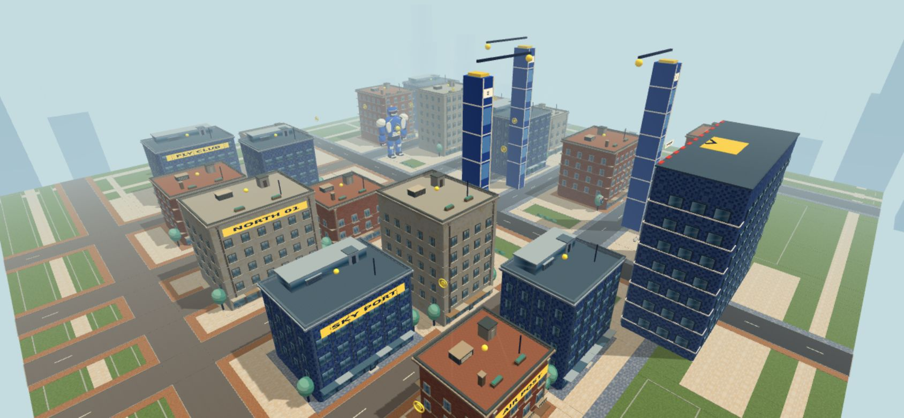
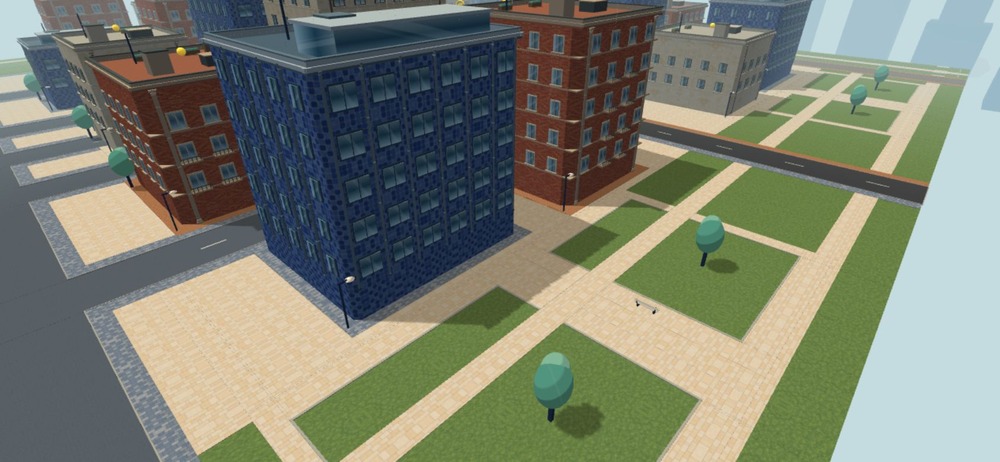
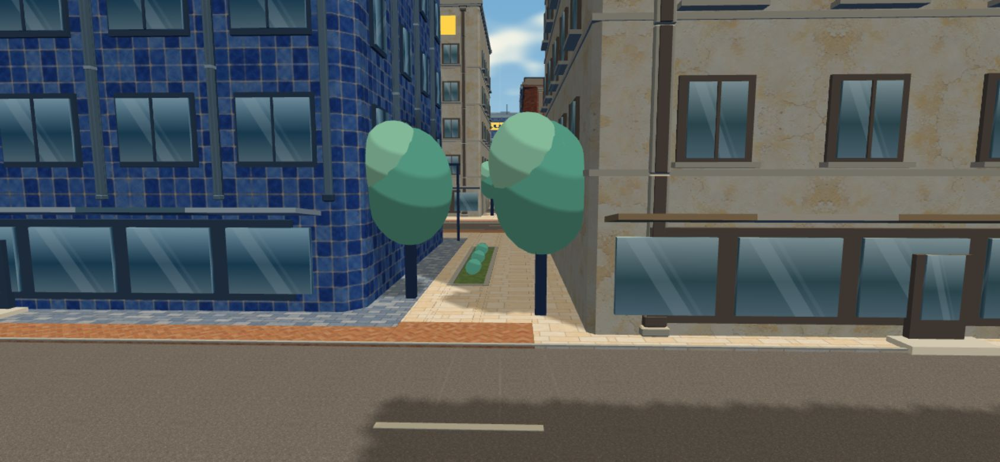
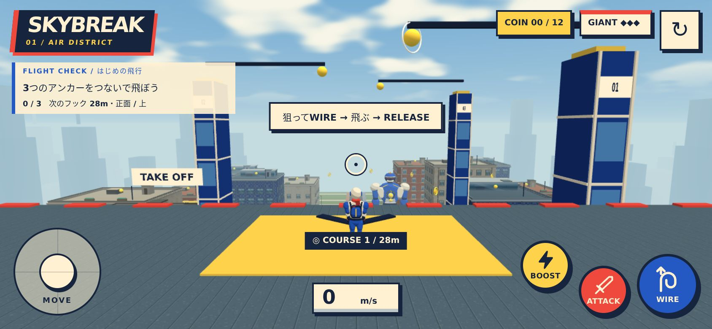

# 路地・共有庭・広場・外周緑地

道路と建物の間に残っていた単色の地面を、歩道につながる舗装、低い植栽のある共有庭、小公園、外周緑地へ変更しました。建物ごとの色分けは既存の入口周辺に残し、新しい舗装は主にクリームの石板で統一しています。

## 配置

- 細い隙間は歩道と連続する舗装。広めの建物間には縁石付きの細い緑地と低木を置き、片側の通行帯を確保しています。
- 開始ビルの手前には開けた広場とベンチ。中央道路、コース支柱の周囲、巨人の周囲は見通しを残しています。
- 奥側（+Z）には芝生を小道で区切った小公園。既存の40本の木のうち4本をここへ移し、本数は増やしていません。
- 外周は道路で区切られた連続緑地と遊歩道。建物の奥には緑の帯と裏側の通路を配置しています。
- ベンチは開始広場に2基、小公園に2基の計4基。樹木の影は既存の静的シャドウマップを共用します。

## 素材と描画

- 内蔵の画像生成で芝生1枚を作成。最終素材は `src/assets/landscape/sage-lawn.webp`（1024×1024、210,858 bytes）。[完全なプロンプト](landscape-texture-prompt.json)を保存しています。
- 4×4mのワールド座標UV、ミラー反復、ミップマップ、異方性フィルタリングを使用。完全な周期形状は保証せず、遠方の細かな模様はミップマップで抑えています。
- 石板・敷石・縁石は道路の既存素材、ベンチと低木は街の既存色を共用。新しいマテリアルと画像は芝生の1種類だけです。
- 道路・歩道の既存バッチへ新しい舗装と縁取りを結合し、芝生とベンチ2素材で3バッチ追加。低木は既存の植栽バッチに結合しています。
- 開始場面は描画回数140→143回、総頂点数410,927→431,693（約5.1%増）。新規テクスチャの転送量は約211KBです。ファイル容量はGPU上の展開後メモリ量とは異なります。

## 地面の分割とゲームへの影響

`city-landscape-plan.ts` は道路、既存歩道、建物、開始ビル、コース支柱の占有領域を引き、新しい面を互いに重ならない矩形に分割します。残った土地には必ず舗装か緑地を割り当てます。縁石や芝の高さを区別し、同一平面の重なりを避けています。

建物配置、当たり判定、ワイヤー接続点、コイン、巨人、飛行の物理・ルールは変更していません。ベンチ・低木は既存の街路樹と同じく描画専用で、追加の衝突判定はありません。

## 確認

- `npm run build`、`npm run verify:city`、`npm run verify:flight`、`npm run verify:gameplay` 成功。
- 地面分割のテスト：市域全体の被覆面積、道路・建物の除外、区画の重なり、境界、重複した除外領域を検証。
- 開発版ブラウザ：全素材の読み込み、有限の頂点・法線、コンソール／シェーダーエラーなし。舗装457面の重なり0。
- 本番ビルド：PCのキーボードと横画面スマホのタッチエミュレーションでワイヤー接続、ブースト、解除、リトライを確認。
- 上の俯瞰・公園・路地画像は、実際のゲームシーンの確認用カメラで撮影しています。下は通常のプレイ画面です。
- スマホ実機のFPS、発熱、長時間プレイは未確認です。

## 公開先

プレイ用URL： https://skybreak.hellowinners861.chatgpt.site

この変更をmainへマージした後、そのソースから作成した本番ビルドをSitesへ配置します。GitHubのmainへのpushが自動でSitesへ反映される設定ではありません。以後の更新でもmainのビルドと公開が必要です。サイトは所有者限定で、所有者のChatGPTアカウントで利用します。
