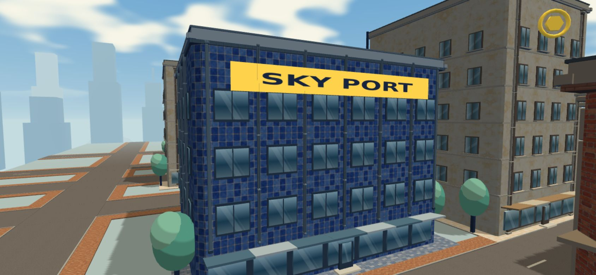
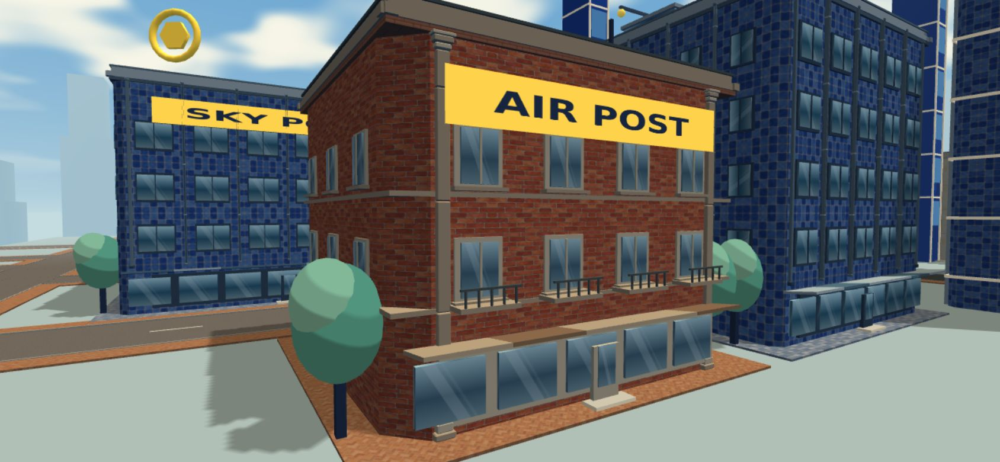

# 外壁の装飾柱の更新

道路・歩道の更新（PR #8）をmainへ反映した後、壁の角柱と縦フィンを、外壁に合う装飾柱へ更新しました。

| 建物 | 柱の仕上げ |
| --- | --- |
| レンガ住宅 | アイボリーと砂色の石造り。台座、分割した石の継ぎ目、段のある柱頭 |
| 青いタイルのビル | 細い金属の部材。面取りした2本のリブで中央の溝を作り、固定金具と上下のキャップを追加 |
| クリームの塗り壁 | 壁になじむ石色の柱。中央に一段高い面を重ね、台座と段のある上端を追加 |

## 形状と配置

- 柱の角と上下の縁を面取りし、小さな面が光を受けて厚みを見せる形状にしました。石の継ぎ目は分割した形状の隙間です。
- 台座を歩道の高さに合わせ、柱頭を屋上の縁へつなぎました。金属の縦フィンは従来の0.5mの奥行きから、リブの厚さ0.25mに抑えています。
- 窓を左右対称の間隔に配置し、隅の柱の場所を確保しました。金属の縦フィンは窓の中央ではなく、窓と窓の間に配置します。
- 隅の柱は前後の面へ、金属フィンは4面へ配置します。素材は窓と屋上で使用している既存の石色・金属色を共有しています。
- 柱は窓や設備と同じ素材別の静的バッチへ結合しています。細い固定金具と溝の奥の部材は簡単な形状にして負荷を抑えています。追加の画像・テクスチャ・依存関係はありません。
- 開始位置、建物の衝突範囲、ワイヤーの接続点、飛行・収集・戦闘のルールは変更していません。柱は既存の外壁装飾と同様に描画専用です。

## 確認

- `npm run build`、`npm run verify:city`、`npm run verify:flight`、`npm run verify:gameplay`：成功。
- `verify:city`に柱の4形状（石の本体・細いリブ・柱頭・薄い段差）の検証を追加。寸法内の頂点、外向きの単位法線、閉じた面、有限のUV、既存の箱との結合を確認しました。
- 開発版で素材読み込みと頂点／法線を確認。コンソール・シェーダーエラーなし。道路と歩道184面の重なり0も維持しています。
- 本番版のPC・横画面スマホでワイヤー接続・ブースト・解除・リトライを確認。
- 開始・飛行の確認場面の描画回数は140回で前版と同じです。開始場面の総頂点数は278,575から410,927へ増えています。スマホ実機のFPS・発熱・長時間プレイは引き続き未確認です。
