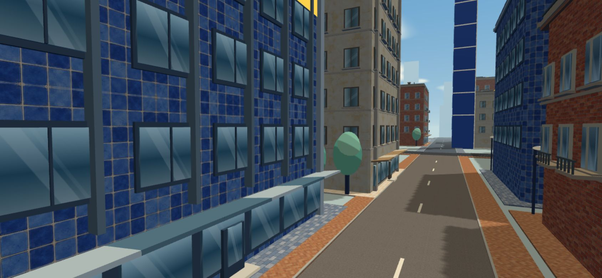
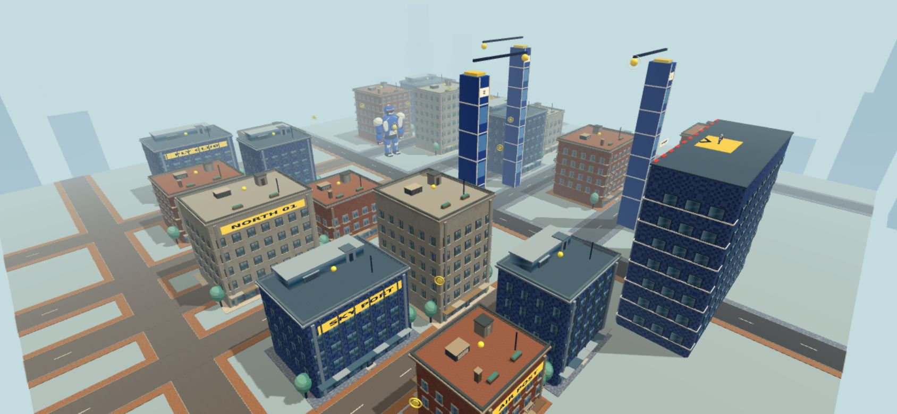

# 生成画像による道路と歩道

窓と屋上の更新（PR #7）をmainへ反映した後、道路3種類・歩道3種類を画像生成して街へ組み込みました。既存のレンガ、青いタイル、クリームの建物に合わせた色合いです。

| 種類 | 素材 | ファイル | サイズ |
| --- | --- | --- | --- |
| アスファルト | 青灰色の細粒 | `src/assets/streets/asphalt-blue.webp` | 405,058 bytes |
| アスファルト | 暖色の灰色 | `src/assets/streets/asphalt-warm.webp` | 401,346 bytes |
| アスファルト | 濃いチャコール | `src/assets/streets/asphalt-charcoal.webp` | 371,712 bytes |
| 歩道 | クリームの石板 | `src/assets/streets/sidewalk-cream.webp` | 191,858 bytes |
| 歩道 | 青灰色の敷石 | `src/assets/streets/sidewalk-slate.webp` | 295,618 bytes |
| 歩道 | 暖色の斜めレンガ | `src/assets/streets/sidewalk-brick.webp` | 247,644 bytes |

6枚はオリジナルの生成画像を1024×1024のRGB WebPに変換したものです。合計1,913,236 bytes（約1.91MB）。生成時の完全な指示は [プロンプト一覧](street-texture-prompts.json) に記録しています。内蔵の画像生成を使用しました。

## 組み合わせ

西側の道路は暖色の灰色、東側は青灰色、中央の南北道路はチャコールです。建物前はレンガ住宅に暖色レンガ、青いビルに青灰色の敷石、塗り壁にクリームの石板を割り当てます。道路の素材と建物前の歩道の素材は独立しているため、街区ごとに組み合わせが変わります。

## 実装

- 既存の十字道路に街区をつなぐ街路を加え、8m幅の舗装を配置しています。建物・開始位置・コースの接続点・衝突範囲は維持しています。
- 建物前の歩道を街路沿いの歩道へつなぎ、縁石を加えています。道路と歩道の面を分割して重なりを除き、交差点でも模様のちらつきを防ぎます。
- UVはワールド座標の実寸です。アスファルトは画像1枚あたり1×1m、歩道は2.4×2.4mで反復し、隣接する面でも密度と位置がそろいます。
- 生成画像の端はミラー反復で色の断絶を抑えます。生成結果の石や目地は完全な周期形状を保証するものではありません。
- 白線と横断歩道は画像に含めず、別の薄いメッシュで重ねています。交差点を避けて破線を置きます。
- アスファルト3・歩道3・縁石1・白線1の計8バッチにまとめて描画します。共有テクスチャ、ミップマップ、異方性フィルタリングを使用し、毎フレームの素材生成はありません。外部素材への実行時アクセスや追加の依存関係はありません。
- 装飾は描画専用です。飛行・収集・戦闘のルールは変更していません。

## 確認

- `npm run build`、`npm run verify:city`、`npm run verify:flight`、`npm run verify:gameplay`：成功。
- 6種類の生成テクスチャが読み込まれ、道路・歩道・縁石・白線は8バッチに結合されています。未読み込み素材、非有限の頂点／法線、コンソール・シェーダーエラーなし。
- 道路と歩道の生成後の頂点から各面の矩形を取り出し、面同士の重なりがないことを確認しています。
- 本番版のPC・横画面スマホでワイヤー接続・ブースト・解除・リトライを確認。
- 確認した開始・飛行場面の描画回数は140回（窓と屋上の版は134回）。スマホ実機のFPS・発熱・長時間プレイは未確認です。
