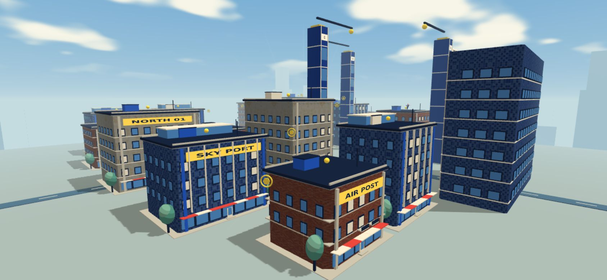
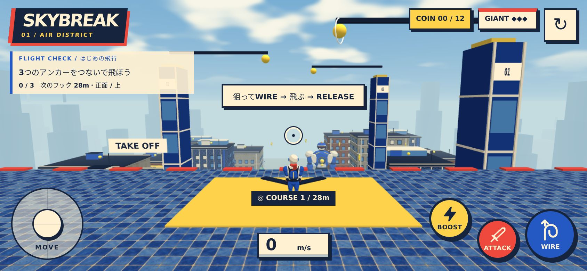
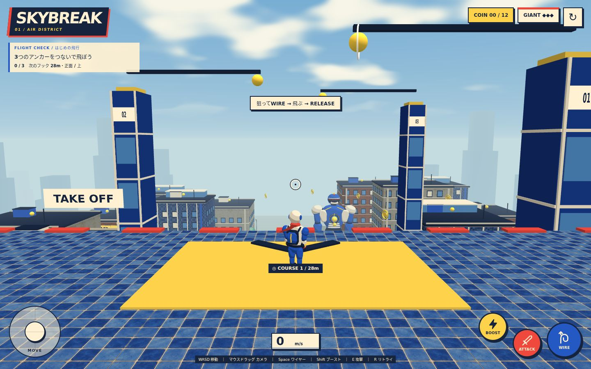
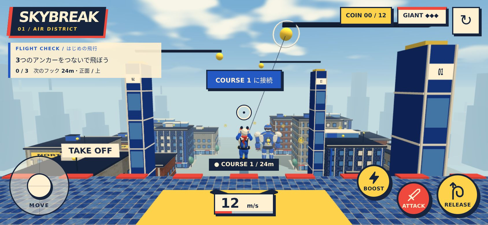

# 生成画像による外壁更新

承認された3枚の生成画像を、Babylon.jsの外壁素材として組み込みました。住宅にはテラコッタのレンガ、モダンなビルにはコバルトのタイル、商業建築にはクリームの塗り壁を使用しています。

## 素材と実装

素材はこのプロジェクト向けに画像生成したオリジナルのプレビューです。ユーザーが選んだ画像をRGB・1024×1024のWebPへ変換し、外部サービスへの実行時アクセスなしで配信します。追加の実行時依存関係はありません。

| 素材 | ファイル | 画像1枚が覆う幅×高さ | ファイルサイズ |
| --- | --- | --- | --- |
| レンガ | `src/assets/walls/terracotta-brick.webp` | 2.4×1.8m | 216,766 bytes |
| 青いタイル | `src/assets/walls/cobalt-tile.webp` | 4×4m | 199,072 bytes |
| クリームの塗り壁 | `src/assets/walls/cream-plaster.webp` | 6×6m | 304,710 bytes |

合計720,548 bytes（約721KB）。建物のUVは実寸の周長と高さから生成し、大きな建物でもレンガやタイルを引き伸ばしません。隣接する壁面のUVをつなぎ、画像の端はミラー反復で色の断絶を抑えています。既存の窓・バルコニー・屋上設備は壁の上に残ります。開始地点の青い建物にも同じタイル素材を適用しています。

同じ素材の静的な建物をまとめ、外壁3種類とコース支柱の計4メッシュで描画します。建物の衝突範囲と飛行・収集・戦闘のルールは維持しています。

## 確認結果

- `npm run build`、`npm run verify:city`、`npm run verify:flight`、`npm run verify:gameplay`：成功。
- 外壁9形状について衝突範囲・閉じた形状・法線・実寸UV・角でのUV連続性・メッシュ結合を検証。
- 開発版の横画面スマホ（844×390、DPR 2）で3素材の読み込み、ワイヤー接続・解除・リトライを確認。開始・飛行場面の描画回数は118回（更新前の同じ確認場面は約135回）。描画負荷の参考値でありFPSの保証ではありません。
- 本番ビルドをPC（1440×900）と横画面スマホで確認。キーボード／タッチのワイヤー・ブースト・解除・リトライが動作し、コンソールとシェーダーのエラーはありません。
- スマホ実機のFPS・発熱・長時間プレイは未確認です。
