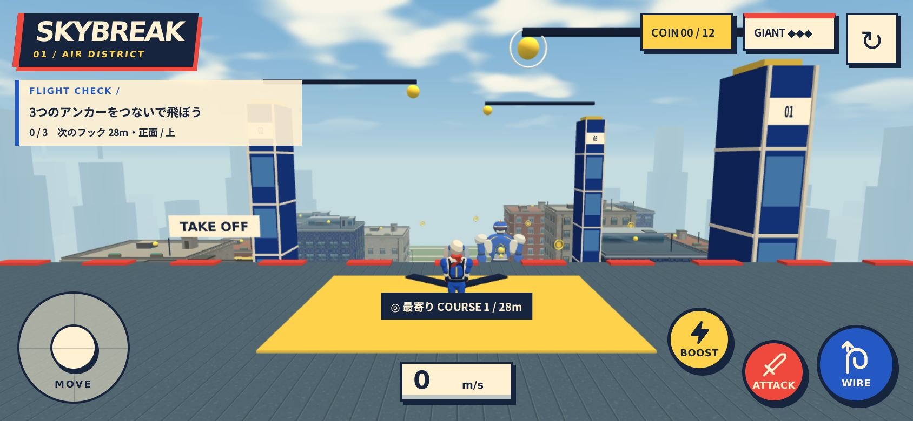
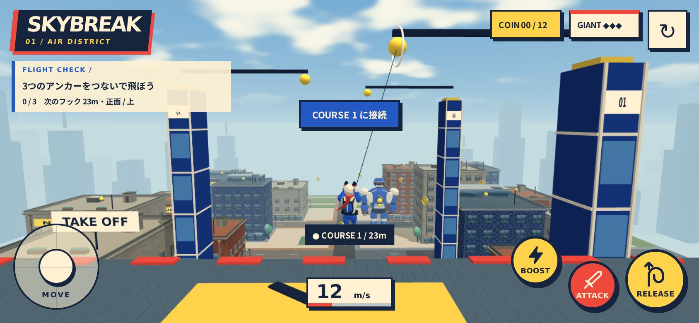
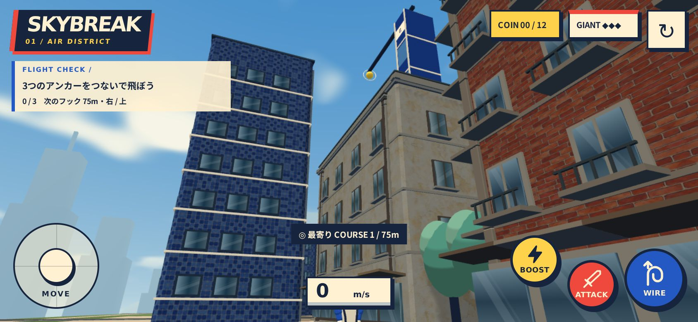
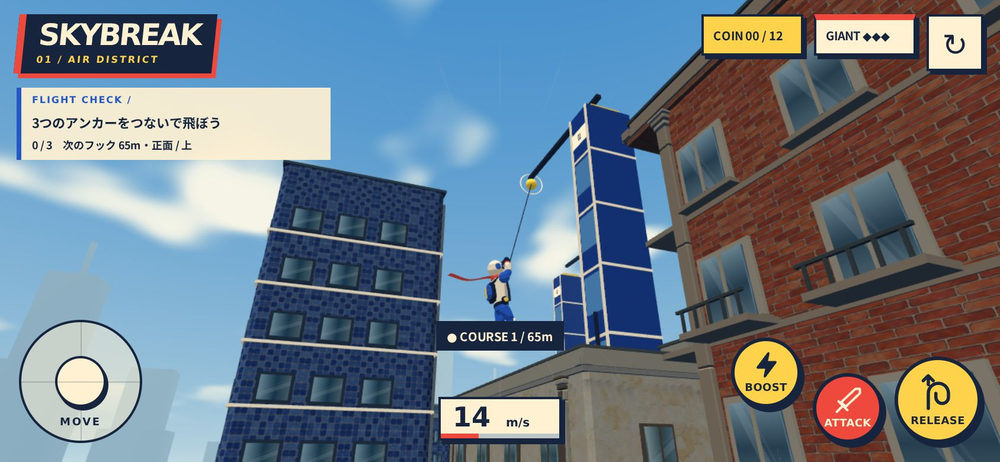

# 画面内の最寄りワイヤーと飛行の修正

## 操作

WIREを押した時点で、画面全体に映っているポイントの中からキャラクターとの3D距離が最短のものへ接続します。中央へ照準を合わせる必要はありません。遮蔽物の裏、カメラの後方は対象外です。コース順や中央への近さによる優先、前の候補への固定はありません。中央マークを取り除き、候補位置のマーカーとHUDの「最寄り」で接続先を示します。接続中にRELEASEを押すと勢いを保って解除します。

黄色い球はすべてワイヤーポイントです。黄色い輪はコインです。距離上限は撤廃し、遮蔽物はカメラからの可視性で判定します。キャラとカメラの視線の違いによる接続拒否・即時解除をなくしました。地面からの接続は上向き28m/sで離陸し、直後に建物へ突っ込む横向きの自動発射を行いません。離陸後の操舵、BOOST、キャラと建物の衝突は通常通りです。地面で上を向く際にカメラが地面下へ回り込まないよう、高さと視線を補正します。

## 物理

- 小さいスティック入力が最大加速度へ変換されていた処理を修正。入力の大きさに比例して旋回します。
- BOOSTの上向き加速の二重加算と、勝手なワイヤー巻き取りを削除。捕捉時の長さを保ちます。
- 接続中と解除後の着地・壁判定を共通化。前ステップで屋上より上にいた場合は屋上へ着地し、横へ押し出しません。
- 着地・壁接触時はワイヤーを解除し、引っ張りと衝突補正の競合を止めます。壁へ向かう速度だけ除き、壁に沿う速度を保ちます。
- 屋上のテイクオフは接続先へ、地面からはまず上向きに離陸します。屋上から歩き出した際にも重力が働きます。

## 確認

`verify:city`、`verify:gameplay`、`verify:flight`、本番ビルドを確認。飛行テストは30/60/120Hzで3アンカー飛行、解除時の慣性、入力強度、ブースト長さ・加速、屋上着地・壁衝突、画面端の最寄り選択、画面外・背後・遮蔽物の除外を検証します。スマホ実機の操作感・FPS・発熱は未確認です。

横画面844×390のタッチエミュレーションでWIRE接続・空中テイクオフ・解除・再試行を確認。コンソールエラーはありません。確認場面は143描画・約43.2万頂点でした。確認用ブラウザの日本語フォントを補って撮影しています。

## 地面からの再接続確認

屋上から実際の移動入力で落下し、地面でカメラを上へ向け、75m先のCOURSE 1へWIREで接続。上向きの離陸後も接続が保たれ、高さ約12.9mまで上昇したことを確認しました。確認用ブラウザで時間を進め、ゲーム本体の更新処理・移動入力・タッチボタンを使用しています。画面内200m先の選択も単体テストで確認。

## GitHub Pages

公開先： https://hellowinners861.github.io/skybreak/

初回にGitHubのSettings → Pages → Build and deployment → Sourceを **GitHub Actions** に設定します。`.github/workflows/pages.yml` がmain更新で検証・ビルドし、distを公開します。PRではビルドだけを行います。Viteの相対baseで /skybreak/ 配下から素材を読み込みます。
